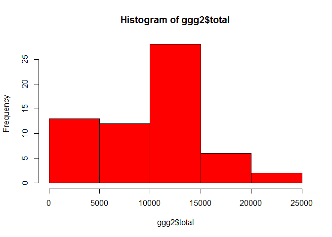
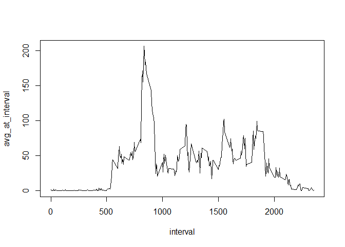
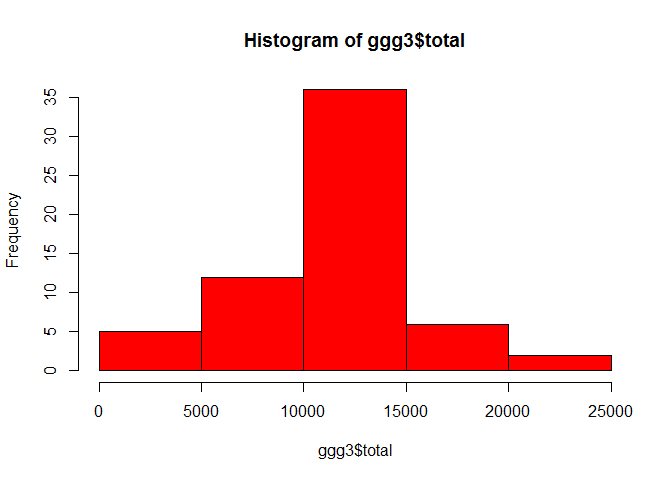
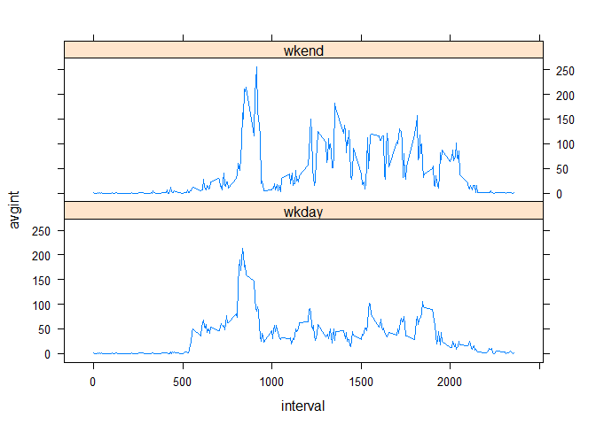

# Reproducible research project

## Activity monitoring data

This is an R Markdown document created to provide the reader with the code and guide to processing the activity data set. This data set was provided in a **csv** format that was loaded into R and saved as **activity_file** using the following commands 


```r
setwd("c:/misc/data science")
active_file<-read.csv("activity.csv")
```

## Loading required packages

To start, we load the required package, dplyr, for the data analysis

```r
library(dplyr)
```

```
## Warning: package 'dplyr' was built under R version 3.3.3
```

```
## 
## Attaching package: 'dplyr'
```

```
## The following objects are masked from 'package:stats':
## 
##     filter, lag
```

```
## The following objects are masked from 'package:base':
## 
##     intersect, setdiff, setequal, union
```
## Preparing data

With the data loaded, we can begin the processing steps. First, convert the 'date' variable to date format. We can the apply the efficient **group_by** and **summarize** functions.

```r
active_file$date<-as.Date(active_file$date)
active_date<-group_by(active_file,date)
ggg<-summarize(active_date,total=sum(steps),avrg=mean(steps,na.rm=TRUE),maxi=max(steps),mini=min(steps))

head(active_file)
```

```
##   steps       date interval
## 1    NA 2012-10-01        0
## 2    NA 2012-10-01        5
## 3    NA 2012-10-01       10
## 4    NA 2012-10-01       15
## 5    NA 2012-10-01       20
## 6    NA 2012-10-01       25
```

```r
head(ggg)
```

```
## # A tibble: 6 × 5
##         date total     avrg  maxi  mini
##       <date> <int>    <dbl> <int> <int>
## 1 2012-10-01    NA      NaN    NA    NA
## 2 2012-10-02   126  0.43750   117     0
## 3 2012-10-03 11352 39.41667   613     0
## 4 2012-10-04 12116 42.06944   547     0
## 5 2012-10-05 13294 46.15972   555     0
## 6 2012-10-06 15420 53.54167   526     0
```


Note that the total steps on 2012-10-01 shows as NA. As shown below, if na.rm=TRUE is used, the total is zero.

```r
ggg2<-summarize(active_date,total=sum(steps,na.rm=TRUE),avrg=mean(steps,na.rm=TRUE),maxi=max(steps,na.rm=TRUE),mini=min(steps,na.rm=TRUE))

head(ggg2)
```

```
## # A tibble: 6 × 5
##         date total     avrg  maxi  mini
##       <date> <int>    <dbl> <int> <int>
## 1 2012-10-01     0      NaN    NA    NA
## 2 2012-10-02   126  0.43750   117     0
## 3 2012-10-03 11352 39.41667   613     0
## 4 2012-10-04 12116 42.06944   547     0
## 5 2012-10-05 13294 46.15972   555     0
## 6 2012-10-06 15420 53.54167   526     0
```

## Mean total number of steps

Below is a histogram showing the total number of steps per day (on the x-axis), and how many days (on y-axis) that occured. The mean, median, and maximun total number of steps taken a day are also shown below.


```r
hist(ggg2$total,col="red")
```

<!-- -->

```r
mean(ggg2$total,na.rm=TRUE)
```

```
## [1] 9354.23
```

```r
median(ggg2$total,na.rm=TRUE)
```

```
## [1] 10395
```

```r
max(ggg2$total,na.rm=TRUE)
```

```
## [1] 21194
```

## Average daily activity pattern

Rather than grouping by date, we can group the data by the 5 minute intervals using the following code.Here, we have plotted a graph of the average number of steps at a given interval (on y-axis), against the corresponding interval (on the x-axis). Also shown below is the interval with the maximum mean total number of steps. This was determined by first ordering the data in descending order of the average number of steps


```r
t_series<-group_by(active_file,interval)
t_seriesdata<-summarize(t_series,avg_at_interval=mean(steps,na.rm=TRUE))
with(t_seriesdata,plot(interval,avg_at_interval,type="l"))
```

<!-- -->

```r
ordered_data<-arrange(t_seriesdata,desc(avg_at_interval))
head(ordered_data)
```

```
## # A tibble: 6 × 2
##   interval avg_at_interval
##      <int>           <dbl>
## 1      835        206.1698
## 2      840        195.9245
## 3      850        183.3962
## 4      845        179.5660
## 5      830        177.3019
## 6      820        171.1509
```

```r
max_interval<-as.numeric(ordered_data[1,1])
max_interval
```

```
## [1] 835
```


##IMPUTING MISSING VALs

In this section, we are interested in filling the missing values with appropriate values. To start with, we want to know how many missing values are in the **steps** column:


```r
sum(is.na(active_file[,1]))
```

```
## [1] 2304
```

Rather than ignoring the NAs as we did previously, we will replace the NAs with the daily average (averaged over the 7 days of a week) at the given interval. This is done using a 'for loop'. Displayed below are the first few rows and last few rows of the modified data.


```r
for(i in 1:length(active_file$interval)){
	inte<-active_file[i,3]
	if(is.na(active_file[i,1])){active_file[i,1]<-t_seriesdata[t_seriesdata$interval==inte,2]
	}
}
head(active_file)
```

```
##       steps       date interval
## 1 1.7169811 2012-10-01        0
## 2 0.3396226 2012-10-01        5
## 3 0.1320755 2012-10-01       10
## 4 0.1509434 2012-10-01       15
## 5 0.0754717 2012-10-01       20
## 6 2.0943396 2012-10-01       25
```

```r
tail(active_file)
```

```
##           steps       date interval
## 17563 2.6037736 2012-11-30     2330
## 17564 4.6981132 2012-11-30     2335
## 17565 3.3018868 2012-11-30     2340
## 17566 0.6415094 2012-11-30     2345
## 17567 0.2264151 2012-11-30     2350
## 17568 1.0754717 2012-11-30     2355
```

Now, we determine the statistics as we did previously:


```r
active_date2<-group_by(active_file,date)
ggg3<-summarize(active_date2,total=sum(steps),avrg=mean(steps,na.rm=TRUE),maxi=max(steps),mini=min(steps))

hist(ggg3$total,col="red")
```

<!-- -->

```r
mean(ggg3$total,na.rm=TRUE)
```

```
## [1] 10766.19
```

```r
median(ggg3$total,na.rm=TRUE)
```

```
## [1] 10766.19
```

```r
max(ggg3$total,na.rm=TRUE)
```

```
## [1] 21194
```

Clearly, this process has a desirable effect of creating a histogram that is more bell-shaped. The mean now coincides with the median. Whereas, without the NAs replaced, the mean was lower than the median.


## Weekday and Weekend activity

In this section, we are interested in determining the statistics of the steps taken during the weekdays, and compare them with weekends. To start, we create a new variable **wkday**, which shows the day of the week (i.e. Monday, Tuesday, e.t.c). We then create a factor variable with two levels, **wkday** and **wkend**, corresponding to days that fall on a weekday or a weekend, respectively. 

```r
act_fileday<-mutate(active_file,wkday=weekdays(date))

data_part3<-mutate(act_fileday,facto=factor(wkday=="Saturday"|wkday=="sunday",labels=c("wkday","wkend")))
head(data_part3)
```

```
##       steps       date interval  wkday facto
## 1 1.7169811 2012-10-01        0 Monday wkday
## 2 0.3396226 2012-10-01        5 Monday wkday
## 3 0.1320755 2012-10-01       10 Monday wkday
## 4 0.1509434 2012-10-01       15 Monday wkday
## 5 0.0754717 2012-10-01       20 Monday wkday
## 6 2.0943396 2012-10-01       25 Monday wkday
```

We can determine the statistics for weekdays separate from weekends as follows:

```r
desireddata<-group_by(data_part3,interval,facto)
desireddata2<-summarize(desireddata,avgint=mean(steps))
head(desireddata2)
```

```
## Source: local data frame [6 x 3]
## Groups: interval [3]
## 
##   interval  facto     avgint
##      <int> <fctr>      <dbl>
## 1        0  wkday 1.94375222
## 2        0  wkend 0.21462264
## 3        5  wkday 0.38447846
## 4        5  wkend 0.04245283
## 5       10  wkday 0.14951940
## 6       10  wkend 0.01650943
```

To create the final plot to show this separate statistics, first load the **lattice** package and apply the **xyplot** function as follows:

```r
library(lattice)
xyplot(avgint~interval|facto,data=desireddata2,layout=c(1,2),type="l")
```

<!-- -->


```r
t_series<-group_by(active_file,interval)
t_seriesdata<-summarize(t_series,avg_at_interval=mean(steps,na.rm=TRUE))
with(t_seriesdata,plot(interval,avg_at_interval,type="l"))
```

<!-- -->

```r
max_interval<-t_seriesdata[max(t_seriesdata$avg_at_interval),1]
max_interval
```

```
## # A tibble: 1 × 1
##   interval
##      <int>
## 1     1705
```

```r
ordered_data<-arrange(t_seriesdata,desc(avg_at_interval))
head(ordered_data)
```

```
## # A tibble: 6 × 2
##   interval avg_at_interval
##      <int>           <dbl>
## 1      835        206.1698
## 2      840        195.9245
## 3      850        183.3962
## 4      845        179.5660
## 5      830        177.3019
## 6      820        171.1509
```

```r
as.numeric(ordered_data[1,1])
```

```
## [1] 835
```
